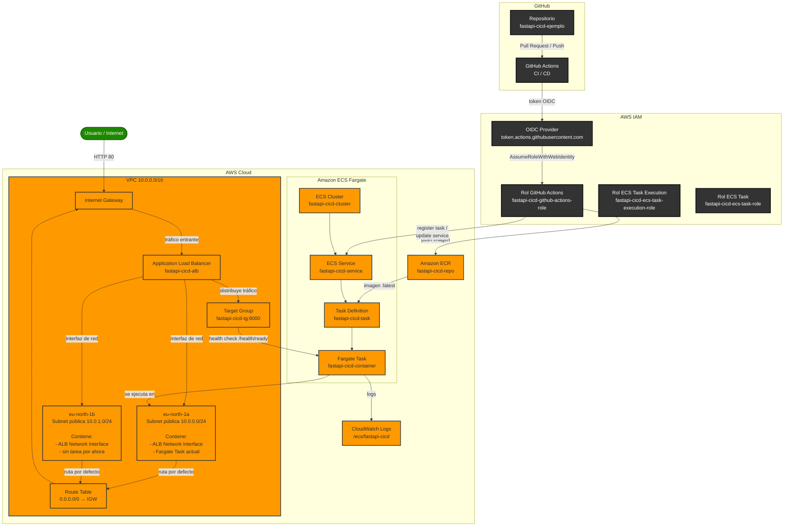

# FastAPI CI/CD en AWS ECS Fargate

Proyecto de aprendizaje de **DevOps**: una API mínima en FastAPI, empaquetada en Docker y desplegada automáticamente en **AWS ECS Fargate** usando **GitHub Actions** y **Terraform**.

> El objetivo no es la API en sí, sino aprender el flujo completo: código → CI → imagen Docker → CD → AWS.

---

## Arquitectura



> **¿Por qué dos zonas de disponibilidad?**
>
> AWS exige al menos **2 subnets en distintas AZ** para crear un ALB. Aunque ahora haya solo 1 tarea en `eu-north-1a`, el ALB también tiene una interfaz de red en `eu-north-1b` para alta disponibilidad.

### Componentes

| Componente | Tecnología | Función |
|---|---|---|
| **Código fuente** | FastAPI + Python | API mínima con health checks |
| **Contenedor** | Docker | Empaqueta la app |
| **CI/CD** | GitHub Actions | Tests, linting, build y deploy |
| **Imágenes** | Amazon ECR | Almacena imágenes Docker |
| **Infraestructura** | Terraform | Crea VPC, ALB, ECS, IAM |
| **Compute** | AWS ECS Fargate | Ejecuta contenedores |
| **Balanceador** | Application Load Balancer | Recibe y reparte tráfico HTTP |
| **Logs** | Amazon CloudWatch | Guarda logs |
| **Auth** | IAM + OIDC | GitHub Actions accede a AWS sin claves estáticas |

### Flujo resumido

```text
feature/* → PR a dev → CI → merge a dev → PR a main → CI → merge a main → CD → AWS ECS
```

Para el flujo completo ver [`docs/ci-cd.md`](docs/ci-cd.md).

---

## Requisitos

- Cuenta de AWS.
- Cuenta de GitHub.
- [AWS CLI](https://docs.aws.amazon.com/cli/latest/userguide/install-cliv2.html) configurada (`aws configure`).
- [Terraform](https://developer.hashicorp.com/terraform/tutorials/aws-get-started/install-cli) >= 1.5.0.
- [Docker](https://docs.docker.com/get-docker/).

---

## Estructura del proyecto

```text
.
├── app/                    # API mínima en FastAPI
├── tests/                  # Tests con pytest
├── infra/                  # Infraestructura con Terraform
├── .github/workflows/      # CI/CD con GitHub Actions
├── docs/                   # Documentación
├── Dockerfile
├── docker-compose.yml
├── requirements.txt
└── requirements-dev.txt
```

---

## Ejecutar localmente con Docker

La app solo se ejecuta localmente mediante Docker.

### Con Docker Compose

```bash
docker compose up --build
```

### Con Docker directamente

```bash
docker build -t fastapi-cicd-ejemplo:local .
docker run -p 8000:8000 fastapi-cicd-ejemplo:local
```

### Probar la API

```bash
curl http://localhost:8000/
curl http://localhost:8000/health/ready
```

Para detener: `Ctrl+C` o `docker compose down`.

---

## Desplegar en AWS

1. Crea la infraestructura con Terraform: [`docs/aws-setup.md`](docs/aws-setup.md).
2. Configura GitHub: [`docs/ci-cd.md`](docs/ci-cd.md).
3. Haz push a `main` y el pipeline despliega automáticamente.

---

## Documentación

| Archivo | Contenido |
|---|---|
| [`docs/ci-cd.md`](docs/ci-cd.md) | Configuración de GitHub Actions y flujo completo |
| [`docs/aws-setup.md`](docs/aws-setup.md) | Crear infraestructura con Terraform |
| [`docs/cloudwatch-alarms.md`](docs/cloudwatch-alarms.md) | Alarmas básicas de monitoreo |
