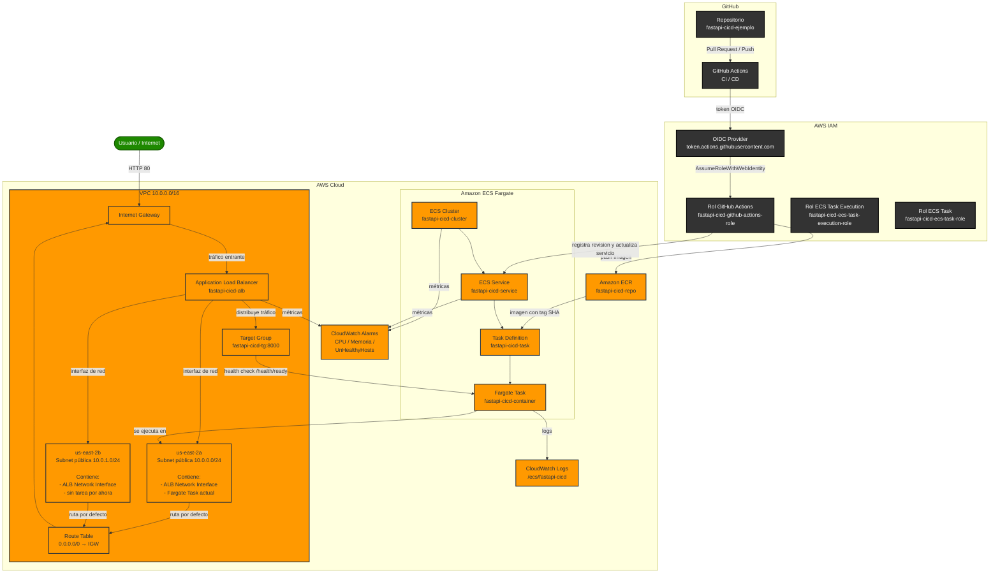
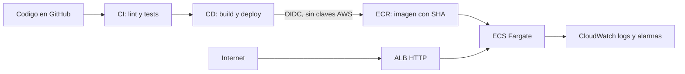

# FastAPI CI/CD en AWS ECS Fargate

Laboratorio práctico para aprender cómo una modificación de código llega a producción: FastAPI se empaqueta con Docker, Terraform crea AWS y GitHub Actions prueba y despliega la imagen.

No hace falta conocer CI/CD, Terraform ni AWS antes de empezar. Sigue las guías en este orden y no saltes pasos.

## Qué construirás



### Vista rápida del despliegue



| Concepto | En este proyecto |
|---|---|
| Docker | Empaqueta la API para ejecutarla igual en tu equipo y AWS. |
| Terraform | Archivos que describen y crean la infraestructura AWS. |
| CI | GitHub ejecuta lint y tests antes de integrar cambios. |
| CD | GitHub crea una imagen y actualiza ECS después de aprobar el despliegue. |
| ECS Fargate | Servicio AWS que ejecuta el contenedor sin administrar servidores. |
| OIDC | GitHub obtiene permisos temporales en AWS, sin guardar Access Keys allí. |

## Antes de empezar

Necesitas una cuenta de GitHub, una cuenta AWS con facturación habilitada, Docker, AWS CLI y Terraform 1.10 o superior. Instala:

- [Docker](https://docs.docker.com/get-docker/)
- [AWS CLI](https://docs.aws.amazon.com/cli/latest/userguide/install-cliv2.html)
- [Terraform](https://developer.hashicorp.com/terraform/tutorials/aws-get-started/install-cli)

> AWS cobra por los recursos creados. El ALB y Fargate generan coste incluso sin tráfico. Destruye la infraestructura al terminar el laboratorio.

### Free Tier y costes

Una cuenta AWS nueva puede incluir hasta $200 en créditos y un plan gratuito de hasta 6 meses. Este laboratorio puede consumir esos créditos porque usa ALB, Fargate e IPv4 públicas; revisa **AWS Console > Cost and Usage** antes de crear recursos y no cambies al plan de pago si quieres evitar cargos.

Al terminar las pruebas, elimina los recursos con `terraform destroy` desde la carpeta `infra`. Consulta los límites y créditos vigentes en [AWS Free Tier](https://aws.amazon.com/free/).

## Ruta de aprendizaje

1. Crea una copia del repositorio en tu cuenta de GitHub mediante **Fork** y clónala en tu equipo.
2. Comprueba la API localmente con Docker.
3. Prepara el repositorio, las ramas y el entorno `production` con la [Fase 1 de CI/CD](docs/ci-cd.md#fase-1-preparar-github-antes-de-aws).
4. Sigue [Crear infraestructura en AWS](docs/aws-setup.md).
5. Guarda los outputs de Terraform y ejecuta el despliegue con la [Fase 2 de CI/CD](docs/ci-cd.md#fase-2-despues-de-crear-aws).
6. Aprueba el entorno `production` y comprueba la API.
7. Consulta [Logs y alarmas](docs/cloudwatch-alarms.md).

## Probar la API localmente

Inicia Docker Desktop y ejecuta desde la raíz del proyecto:

```bash
docker compose up --build
```

En otra terminal, abre `http://localhost:8000/docs` o ejecuta:

```bash
curl http://localhost:8000/health/ready
```

La respuesta esperada es `{"status":"ready"}`. Detén el contenedor con `docker compose down`.

## Estructura

```text
app/                 API FastAPI
tests/               Tests de la API
infra/               Terraform: red, ECS, ECR, IAM y alarmas
.github/workflows/   Automatizaciones de CI y CD
```

## Límites del laboratorio

El ALB está expuesto por HTTP para simplificar el aprendizaje. Antes de usar esta arquitectura con usuarios reales, añade dominio, certificado ACM, HTTPS, redirección HTTP a HTTPS y una revisión de seguridad/costes.
